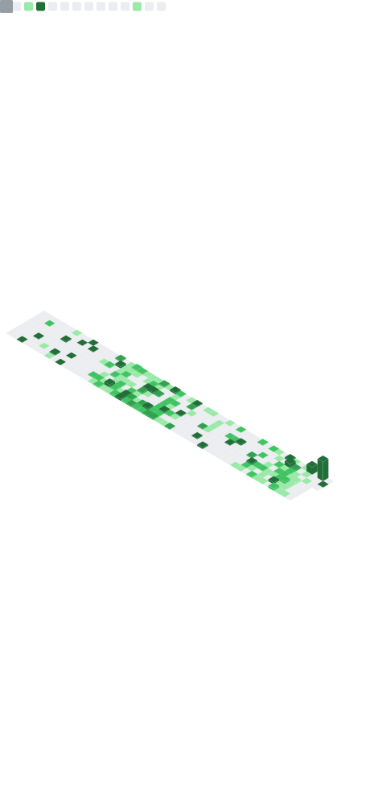

###### warning: laggy readme beware, also i hate document db so don't ask one  

  

<h1 style="align-items: center; display: flex; justify-content: center;">Hello! My name is mooping</h1>  

## Who are you?
I am a backend developer and discord bot developer. You can contact me through Discord (timelessnesses)  
  

## Skills

- Python
- Rust
- Golang
- Javascript (I don't use it that much)
- Typescript (I love typescript (I biased))
- Lua (I don't really use it)
- PostgreSQL (cooler than SQLite)
- MySQL (nah)
- SQLite
- FastAPI
- Flask
- SvelteKit
- Roblox Game Scripting
- (kinda) Full Stack (?)

## Statistic

###### Timeless (as known as Rukchad Wongprayoon) (as known as Mooping) (as known as Unpredictable) is not responsible for accidental digital consciousness transfer, real world manifestations of digital characters, nightmares, night terrors, night sweat, disapperance, death, or dismemberment. 
