  

<h1 style="align-items: center; display: flex; justify-content: center;">Hello! My name is Timeless (or Timelessnesses or Timmy or whatever)</h1>  

## Who are you?
walalalalalallal a cat that codes walalalallalalalalalala  
  

## Skills

- Python
- C sharp (.NET)
- Ruby (I don't know what to do with it.)
- Javascript (I don't use it that much)
- Typescript (I love typescript(I biased))
- Lua (I don't really use it)
- HTML (I don't make front-end sometimes my front-end sucks)
- PostgreSQL (cooler than SQLite)
- MySQL (nah)
- SQLite
- FastAPI
- Flask
- SvelteKit
- Roblox Game Scripting
- (kinda) Full Stack (?)

## Statistic

###### Timeless (as known as Rukchad Wongprayoon) (as known as Mooping) (as known as Unpredictable) is not responsible for accidental digital consciousness transfer, real world manifestations of digital characters, nightmares, night terrors, night sweat, disapperance, death, or dismemberment. 

## [support server for questions](https://discord.gg/hUTfGPdZaP)

<table><tbody><tr><td>  </td></tr></tbody></table>
